## Metric Results - 18 nodes
Here we show graphics relative to CPU, memory and event latency metrics relative of our pubsub middleware in different scenarios and of 18 peers. This results were collected from a testground environment:
- Executed on: ubuntu VM with 12GB RAM and 4 cores.
- Latency between peers: 10ms

### Normal Scenario
Here things are chill.


```python
import process_run

process_run.plot_memory_metric("normal")
process_run.plot_cpu_metric("normal")
process_run.plot_latency_metric("normal")
```


    
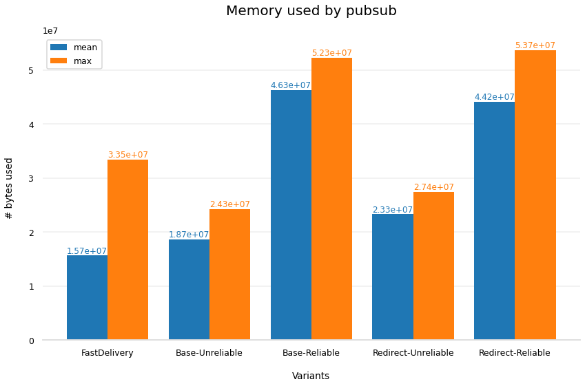
    


    


    
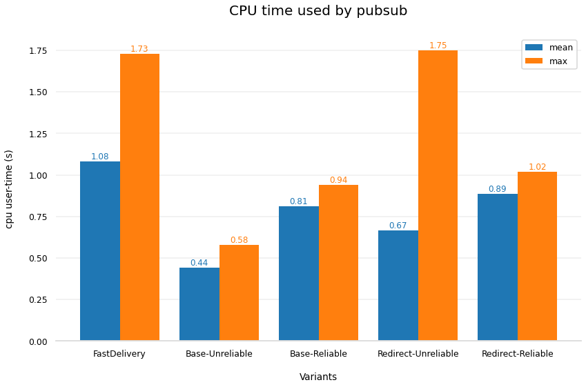
    


    


    
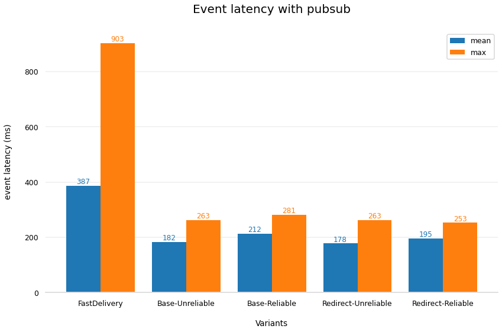
    


### Subscription Burst Scenario
Here at the same time that events are being published, all subscribers are floding the middleware with new subscriptions, that are irrelevant to the events' forwarding, but will load the system.


```python
import process_run

process_run.plot_memory_metric("subBurst")
process_run.plot_cpu_metric("subBurst")
process_run.plot_latency_metric("subBurst")
```


    
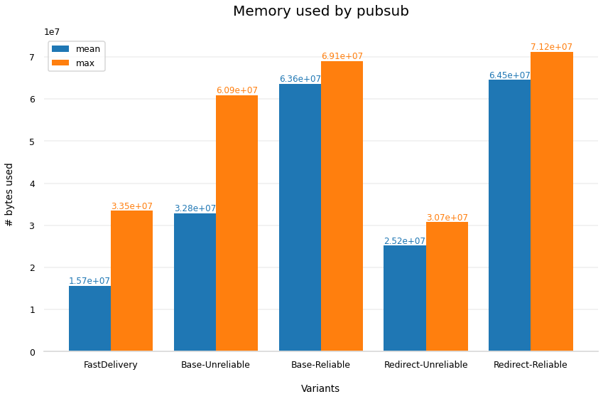
    


    


    
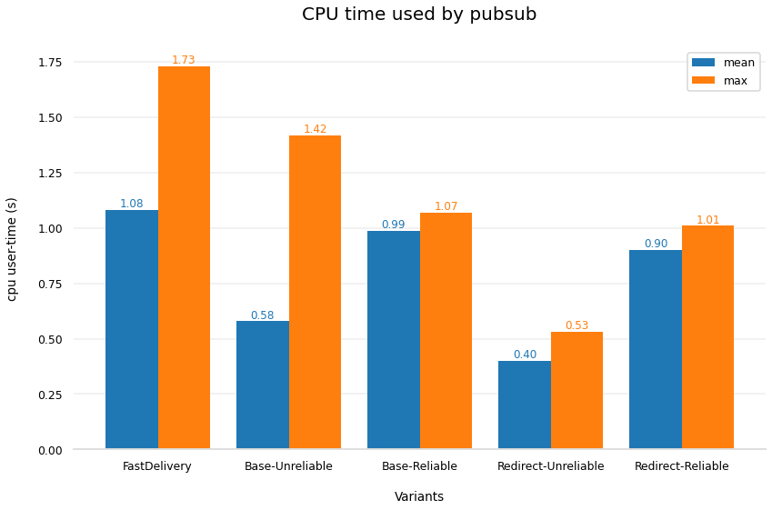
    


    


    
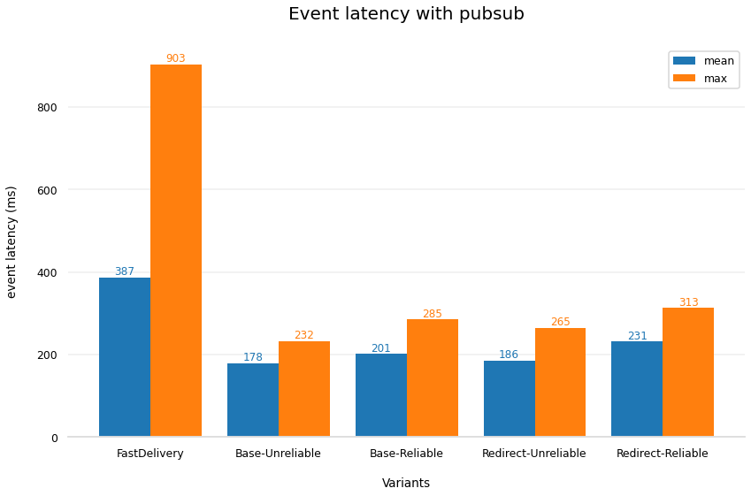
    


### Event Burst Scenario
Here the number of events published is significantly bigger. This way analyze how the system behaves in a scenario like this one.


```python
import process_run

process_run.plot_memory_metric("eventBurst")
process_run.plot_cpu_metric("eventBurst")
process_run.plot_latency_metric("eventBurst")
```


    
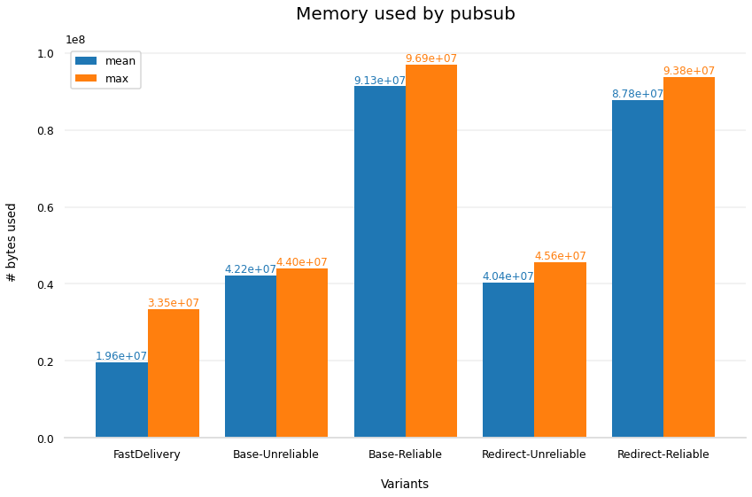
    


    


    
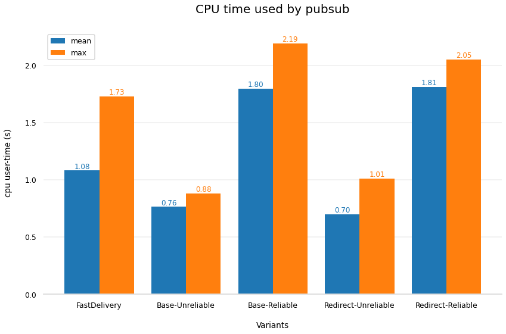
    


    


    
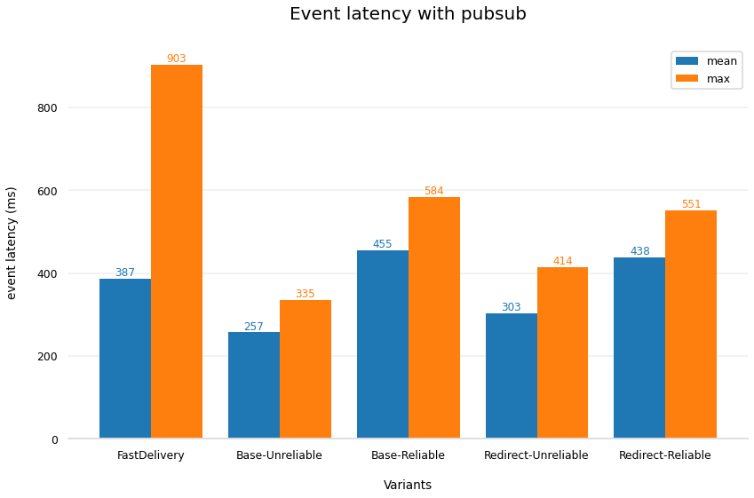
    


### Fault Tolerance Scenario
Here we have a scenario similar to the normal one, but this time one group of subs crashes after the subscription routine.


```python
import process_run

process_run.plot_memory_metric("fault")
process_run.plot_cpu_metric("fault")
process_run.plot_latency_metric("fault")
```


    
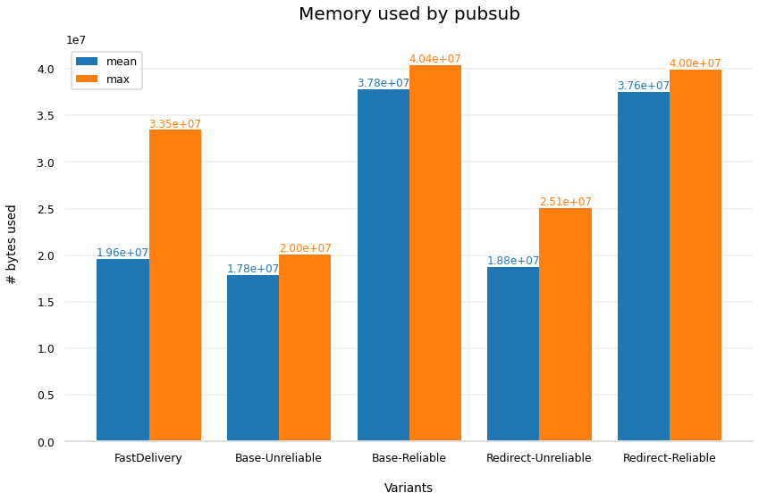
    


    


    
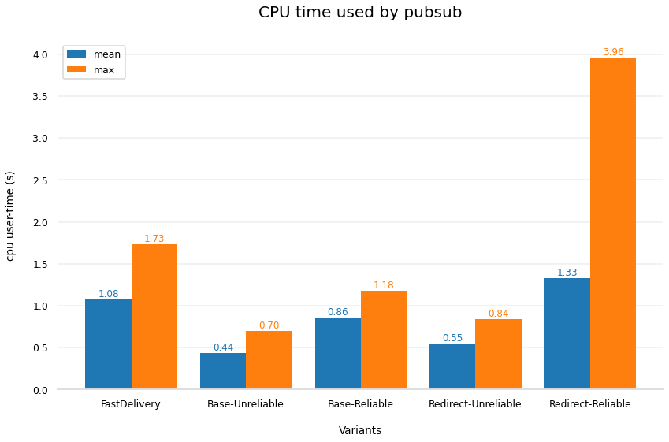
    


    


    
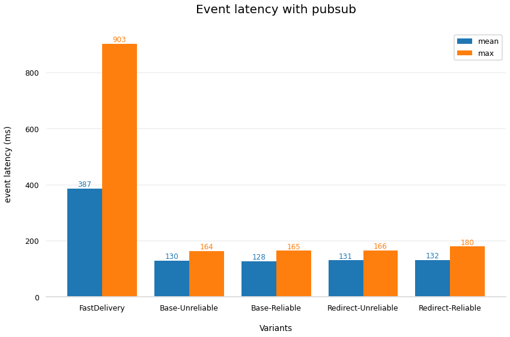
    

